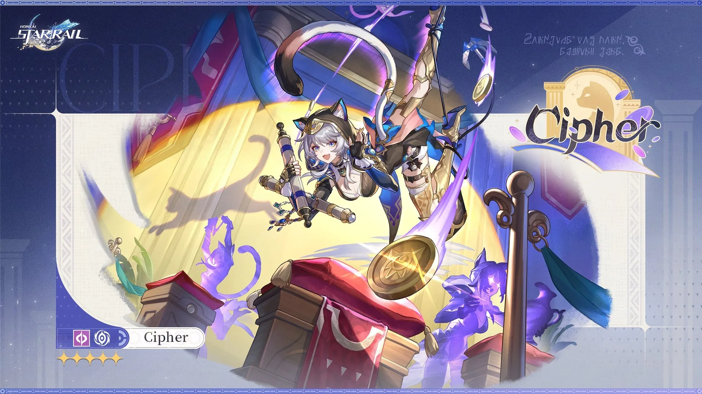
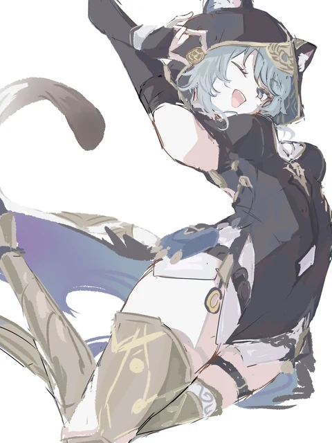

# STARRAILdle



Daily character-guessing game for Honkai: Star Rail — Loldle/Wordle-inspired, in French and English.

## Modes

- **Classic** — guess via 9 compared attributes (element, path, lore path, rarity, version, weekly boss, world, factions)
- **Splash Art** — silhouette that zooms out and recenters with each attempt
- **Quote** — guess the character from a real in-game line
- **Skill** — guess from a skill's icon

Every mode has a daily challenge (same for everyone, one per day) and an infinite practice mode (random targets).

## Features



- Colorblind mode (status badges on top of color)
- Installable as a PWA, playable offline
- Rotating background: random official banners across the game's cast

<br clear="right">

## Installation

```
git clone https://github.com/Gaiiiaaa-GH/STARRAILdle.git
cd STARRAILdle
npm install
npm run dev
```

## Data

The roster (`src/data/characters.json`) is generated by `scripts/build_data.py`, which combines:
- base data (elements, paths, icons, rarity) from [Mar-7th/StarRailRes](https://github.com/Mar-7th/StarRailRes)
- factions and lore paths, researched on the Fandom wiki and merged via `scripts/merge_wiki_research.cjs`
- real quotes, researched on the Fandom wiki and merged via `scripts/merge_quotes.cjs`

To regenerate the dataset after a game update, rerun `python scripts/build_data.py` (requires `scripts/wiki_research/merged.json` and `merged_quotes.json` to be up to date).

Background banners are the wiki's native promo art; the older ones were published below 1080p, so those were upscaled with [Real-ESRGAN](https://github.com/xinntao/Real-ESRGAN) (anime model) to a consistent 1920px width.

## Credits

Banner: official introduction art for Cipher, Honkai: Star Rail.

Fanart above: [@Ais_no_tye](https://x.com/Ais_no_tye).

All character icons, portraits, and banners belong to HoYoverse — used here for non-commercial purposes, sourced via [Mar-7th/StarRailRes](https://github.com/Mar-7th/StarRailRes) and the [Fandom wiki](https://honkai-star-rail.fandom.com).

## Disclaimer

This project is not affiliated with or endorsed by HoYoverse. "Honkai: Star Rail" and all associated names, characters, and artwork are the property of HoYoverse.

## License

See [LICENSE](LICENSE).
